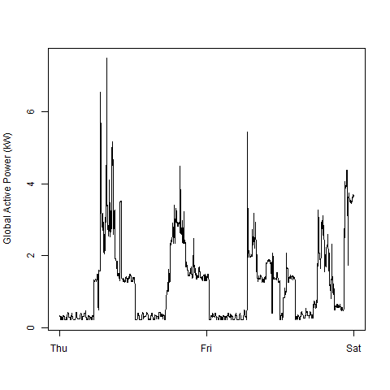
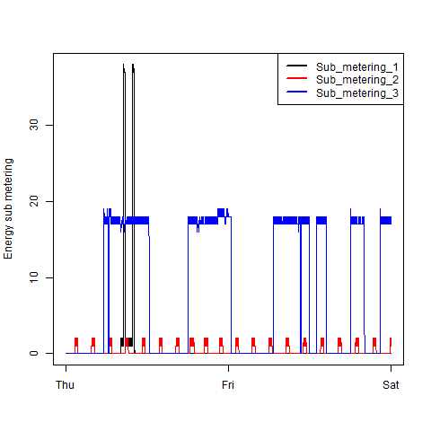

```{r setup, include=FALSE}
knitr::opts_chunk$set(echo = TRUE,cache=TRUE,message=FALSE,warning=FALSE)
library(rmarkdown)
```

`r if(!knitr::is_html_output()) {"* &#x1f468;&#x1F3FB;&#x200d;&#x1f4bb; Author: Anderson H Uyekita"}`
* &#x1f4da; Specialization: [Data Science: Foundations using R Specialization](https://www.coursera.org/specializations/data-science-foundations-r){target='_blank' rel='noopener'}
* &#x1f4d6; Course: [Exploratory Data Analysis](https://www.coursera.org/learn/exploratory-data-analysis){target='_blank' rel='noopener'}
    * &#x1F9D1;&#x200d;&#x1F3EB; Instructor: Roger D Peng
* &#x1F4C6; Week 1
    * &#x1F6A6; Start: 2022/05/24
    * &#x1F3C1; Finish: 2022/05/25
* [&#x1F4CB; Project Instructions](https://github.com/AndersonUyekita/exploratory-data-analysis_course-project-1/blob/master/instructions.md){target='_blank' rel='noopener'}
* `r if(!knitr::is_html_output()) {"&#x1F30E; Rpubs: [Interactive Document](https://rpubs.com/AndersonUyekita/course-project-1_exploratory-data-analysis)"}else{"&#x1F4E6; Github Repository: [Static Document](https://github.com/AndersonUyekita/exploratory-data-analysis_course-project-1){target='_blank' rel='noopener'}"}`

***

## Sinopsis

Course Project 1 aims to reproduce four given graphics from the UC Irvine Machine Learning Repository about "Individual household electric power consumption Data Set". This dataset has 20 Megabytes compressed (zip file) and uncompressed, reaching around 130 megabytes on Windows OS. It is estimated around 142.4 Megabytes of memory to load this text file (The details will be shown on 1. Memory Requirements)

The dataset has more than 2 million rows (observations) and 9 columns according to the instructions. The given instruction made it possible to fill the **colClasses** from the read.table to be faster. Later, in the tidying process of the dataset, it was necessary to convert columns `Date` into a **Date** class object and merge `Data` and `Time` to create a **POSIXlt**.

Finally, I have stored the R scripts on Github. The PNG files on the repository's root are the exported graphics from my R scripts. Those figures were 480 pixels in width and height.

Feel free to look at the [CodeBook](./CodeBook.md) to go in-depth.

***

## 1. Memory Requirements

According to the instructions, the dataset has 2,075,259 rows and 9 columns. Due to the number of rows, estimating the memory needed to load it is necessary.

```{r memory_estimation,cache=TRUE,message=FALSE}
# Number of rows
rows <- 2075259

# Number of columns
columns <- 9

# Numberic data has 8 bytes
bytes <- 8

# Calculating memory requeriments in bytes
memory_b <- rows * columns * bytes

# Calculating memory requeriments in Kilo bytes
memory_kb <- memory_b/(2^10)

# Calculating memory requeriments in Mega bytes
memory_Mb <- memory_kb/(2^10)

# References
# 
# * https://www.r-bloggers.com/2016/07/calculating-memory-requirements/
# * http://adv-r.had.co.nz/memory.html

# Printing the Memory Requirements
memory_Mb
```

The total amount of estimated Memory is `r base::round(memory_Mb, 1)` Megabytes. For this reason, the memory requirement is not a limitation to running this script on this computer.


## 2. Graphics' Reproduction 

### 2.1. Plot 1

```{r,eval=FALSE}
# 1. Libraries used to perform this script. ####
library(lubridate)
library(tidyverse)
library(magrittr)

# 2. Creating a folder to store the downloaded files. ####
if(!file.exists("data")) {
    # If this folder already have been created, it will be ignored.
    dir.create("data")
}

# 3. Downloading the zip file with Electric power consumption from UC Irvine Machine Learning Repository. ####
if(!file.exists("./data/power_consumption.zip")) {
    
    # Download and store it in data folder.
    download.file(url = "https://d396qusza40orc.cloudfront.net/exdata%2Fdata%2Fhousehold_power_consumption.zip",
                  destfile = "./data/power_consumption.zip")
}

# 3.1. Unzipping the power_consumption file
if(!file.exists("./data/household_power_consumption.txt")) {
    
    # Check if the power_consumption.zip has been unzipped
    unzip(zipfile = "./data/power_consumption.zip",
          exdir = "./data",
          list = FALSE,
          overwrite = TRUE)
}

# 4. Loading the data ####
#
# Based on the instruction, we already know the types of the columns.
#
raw_dataset <- read.table(file = "./data/household_power_consumption.txt",
                          header = TRUE,
                          sep = ';',
                          stringsAsFactors = FALSE ,
                          na.strings = "?",
                          nrows = 2075259, 
                          check.names = FALSE,
                          colClasses = c(character(),
                                         character(),
                                         numeric(),
                                         numeric(),
                                         numeric(),
                                         numeric(),
                                         numeric(),
                                         numeric(),
                                         numeric()))

# 5. Manipulating Data ####

# 5.1. Converting the Date column into the Date class object and Filtering the observations
df_tidy <- raw_dataset %>%
    
    # Merging Date and Time POSIXlt.
    mutate(Time = strptime(paste(Date, " " ,Time), "%d/%m/%Y %H:%M:%S")) %>%
    
    # Converging character into Date.
    mutate(Date = as.Date(Date, "%d/%m/%Y")) %>%
    
    # Filtering observations between 2007-02-01 and 2007-02-02.
    filter(Date >= "2007-02-01" & Date <= "2007-02-02")

# 6. Exporting the PNG file ####
png(filename = "./plot1.png",   # The png file will be exported to the repository top-level
    width = 480 ,
    height = 480,
    units = "px",
    bg = "white")

    # Creating the histogram.
    hist(x = df_tidy$Global_active_power,
         col = "red",
         main = "Global Active Power",
         xlab = "Global Active Power (kW)")

dev.off()
```


### 2.2. Plot 2

```{r,eval=FALSE}
# 1. Libraries used to perform this script. ####
library(lubridate)
library(tidyverse)
library(magrittr)

# 2. Creating a folder to store the downloaded files. ####
if(!file.exists("data")) {
    # If this folder already have been created, it will be ignored.
    dir.create("data")
}

# 3. Downloading the zip file with Electric power consumption from UC Irvine Machine Learning Repository. ####
if(!file.exists("./data/power_consumption.zip")) {
    
    # Download and store it in data folder.
    download.file(url = "https://d396qusza40orc.cloudfront.net/exdata%2Fdata%2Fhousehold_power_consumption.zip",
                  destfile = "./data/power_consumption.zip")
}

# 3.1. Unzipping the power_consumption file
if(!file.exists("./data/household_power_consumption.txt")) {
    
    # Check if the power_consumption.zip has been unzipped
    unzip(zipfile = "./data/power_consumption.zip",
          exdir = "./data",
          list = FALSE,
          overwrite = TRUE)
}

# 4. Loading the data ####
#
# Based on the instruction, we already know the types of the columns.
#
raw_dataset <- read.table(file = "./data/household_power_consumption.txt",
                          header = TRUE,
                          sep = ';',
                          stringsAsFactors = FALSE ,
                          na.strings = "?",
                          nrows = 2075259, 
                          check.names = FALSE,
                          colClasses = c(character(),
                                         character(),
                                         numeric(),
                                         numeric(),
                                         numeric(),
                                         numeric(),
                                         numeric(),
                                         numeric(),
                                         numeric()))

# 5. Manipulating Data ####

# 5.1. Converting the Date column into the Date class object and Filtering the observations
df_tidy <- raw_dataset %>%
    
    # Merging Date and Time POSIXlt.
    mutate(Time = strptime(paste(Date, " " ,Time), "%d/%m/%Y %H:%M:%S")) %>%
    
    # Converging character into Date.
    mutate(Date = as.Date(Date, "%d/%m/%Y")) %>%
    
    # Filtering observations between 2007-02-01 and 2007-02-02.
    filter(Date >= "2007-02-01" & Date <= "2007-02-02")

# 6. Exporting the PNG file ####
png(filename = "./plot2.png",
    width = 480 ,
    height = 480,
    units = "px",
    bg = "white")

    # Forcing to printing in English.
    Sys.setlocale("LC_TIME", "English")
    
    # Plotting the Graphic
    plot(df_tidy$Time,
         df_tidy$Global_active_power,
         type="l",
         xlab="",
         ylab="Global Active Power (kW)")

dev.off()
```



### 2.3. Plot 3

```{r,eval=FALSE}
# 1. Libraries used to perform this script. ####
library(lubridate)
library(tidyverse)
library(magrittr)

# 2. Creating a folder to store the downloaded files. ####
if(!file.exists("data")) {
    # If this folder already have been created, it will be ignored.
    dir.create("data")
}

# 3. Downloading the zip file with Electric power consumption from UC Irvine Machine Learning Repository. ####
if(!file.exists("./data/power_consumption.zip")) {
    
    # Download and store it in data folder.
    download.file(url = "https://d396qusza40orc.cloudfront.net/exdata%2Fdata%2Fhousehold_power_consumption.zip",
                  destfile = "./data/power_consumption.zip")
}

# 3.1. Unzipping the power_consumption file
if(!file.exists("./data/household_power_consumption.txt")) {
    
    # Check if the power_consumption.zip has been unzipped
    unzip(zipfile = "./data/power_consumption.zip",
          exdir = "./data",
          list = FALSE,
          overwrite = TRUE)
}

# 4. Loading the data ####
#
# Based on the instruction, we already know the types of the columns.
#
raw_dataset <- read.table(file = "./data/household_power_consumption.txt",
                          header = TRUE,
                          sep = ';',
                          stringsAsFactors = FALSE ,
                          na.strings = "?",
                          nrows = 2075259, 
                          check.names = FALSE,
                          colClasses = c(character(),
                                         character(),
                                         numeric(),
                                         numeric(),
                                         numeric(),
                                         numeric(),
                                         numeric(),
                                         numeric(),
                                         numeric()))

# 5. Manipulating Data ####

# 5.1. Converting the Date column into the Date class object and Filtering the observations
df_tidy <- raw_dataset %>%
    
    # Merging Date and Time POSIXlt.
    mutate(Time = strptime(paste(Date, " " ,Time), "%d/%m/%Y %H:%M:%S")) %>%
    
    # Converging character into Date.
    mutate(Date = as.Date(Date, "%d/%m/%Y")) %>%
    
    # Filtering observations between 2007-02-01 and 2007-02-02.
    filter(Date >= "2007-02-01" & Date <= "2007-02-02")

# 6. Exporting the PNG file ####
png(filename = "./plot3.png",
    width = 480 ,
    height = 480,
    units = "px",
    bg = "white")

    # Forcing to printing in English.
    Sys.setlocale("LC_TIME", "English")

    plot(x = df_tidy$Time,
         y = df_tidy$Sub_metering_1,
         type = "l",
         ylab = "Energy sub metering",
         xlab = "")
    
    lines(x = df_tidy$Time,
          y = df_tidy$Sub_metering_2,
          type = "l",
          col = "red")
    
    lines(x = df_tidy$Time,
          y = df_tidy$Sub_metering_3,
          type = "l",
          col = "blue")
    
    legend(x = "topright",
           legend = c("Sub_metering_1", "Sub_metering_2", "Sub_metering_3"),
           lty = 1,
           lwd = 2.5,
           col=c("black", "red", "blue"))

dev.off()
```



### 2.4. Plot 4

```{r,eval=FALSE}
# 1. Libraries used to perform this script. ####
library(lubridate)
library(tidyverse)
library(magrittr)

# 2. Creating a folder to store the downloaded files. ####
if(!file.exists("data")) {
    # If this folder already have been created, it will be ignored.
    dir.create("data")
}

# 3. Downloading the zip file with Electric power consumption from UC Irvine Machine Learning Repository. ####
if(!file.exists("./data/power_consumption.zip")) {
    
    # Download and store it in data folder.
    download.file(url = "https://d396qusza40orc.cloudfront.net/exdata%2Fdata%2Fhousehold_power_consumption.zip",
                  destfile = "./data/power_consumption.zip")
}

# 3.1. Unzipping the power_consumption file
if(!file.exists("./data/household_power_consumption.txt")) {
    
    # Check if the power_consumption.zip has been unzipped
    unzip(zipfile = "./data/power_consumption.zip",
          exdir = "./data",
          list = FALSE,
          overwrite = TRUE)
}

# 4. Loading the data ####
#
# Based on the instruction, we already know the types of the columns.
#
raw_dataset <- read.table(file = "./data/household_power_consumption.txt",
                          header = TRUE,
                          sep = ';',
                          stringsAsFactors = FALSE ,
                          na.strings = "?",
                          nrows = 2075259, 
                          check.names = FALSE,
                          colClasses = c(character(),
                                         character(),
                                         numeric(),
                                         numeric(),
                                         numeric(),
                                         numeric(),
                                         numeric(),
                                         numeric(),
                                         numeric()))

# 5. Manipulating Data ####

# 5.1. Converting the Date column into the Date class object and Filtering the observations
df_tidy <- raw_dataset %>%
    
    # Merging Date and Time POSIXlt.
    mutate(Time = strptime(paste(Date, " " ,Time), "%d/%m/%Y %H:%M:%S")) %>%
    
    # Converging character into Date.
    mutate(Date = as.Date(Date, "%d/%m/%Y")) %>%
    
    # Filtering observations between 2007-02-01 and 2007-02-02.
    filter(Date >= "2007-02-01" & Date <= "2007-02-02")

# 6. Exporting the PNG file ####
png(filename = "./plot4.png",
    width = 480 ,
    height = 480,
    units = "px",
    bg = "white")

    # Forcing to printing in English.
    Sys.setlocale("LC_TIME", "English")
    
    # Create 4 fields to be filled with 4 plots
    par(mfrow = c(2, 2))
    
    # Top-left
    plot(x = df_tidy$Time,
         y = df_tidy$Global_active_power ,
         type = "l",
         xlab = "",
         ylab = "Global Active Power")
    
    ## Top-right
    plot(x = df_tidy$Time,
         y = df_tidy$Voltage ,
         type = "l",
         xlab = "datetime",
         ylab = "Voltage")
    
    ## Bottom-left
    plot(x = df_tidy$Time,
         y = df_tidy$Sub_metering_1,
         type = "l",
         ylab = "Energy sub metering",
         xlab = "")
    
    lines(x = df_tidy$Time, 
          y = df_tidy$Sub_metering_2, 
          type = "l", 
          col = "red")
    
    lines(x = df_tidy$Time, 
          y = df_tidy$Sub_metering_3, 
          type = "l",
          col = "blue")
    
    legend(x = "topright",
           legend = c("Sub_metering_1", "Sub_metering_2", "Sub_metering_3"),
           lty = 1,
           lwd = 2.5,
           col=c("black", "red", "blue"),
           bty="n")
    
    ## Bottom-right
    plot(x = df_tidy$Time,
         y = df_tidy$Global_reactive_power,
         type = "l",
         col = "black",
         xlab = "datetime",
         ylab = "Global_reactive_power")

dev.off()
```

